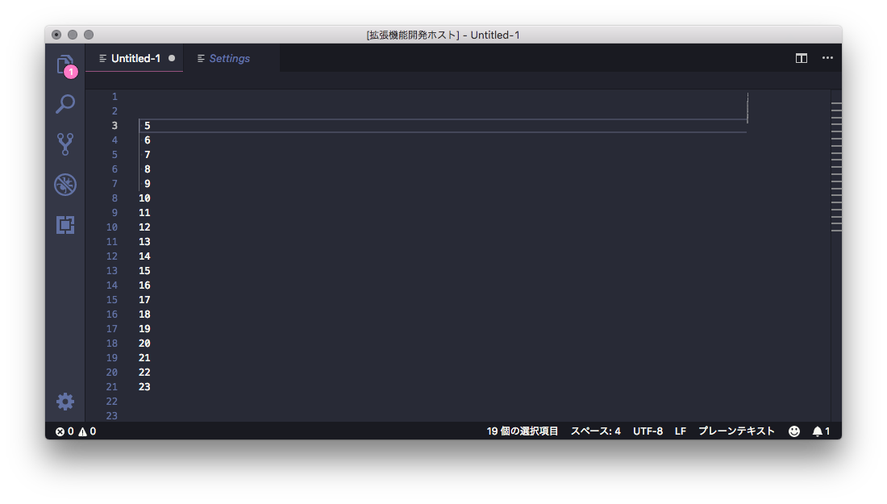
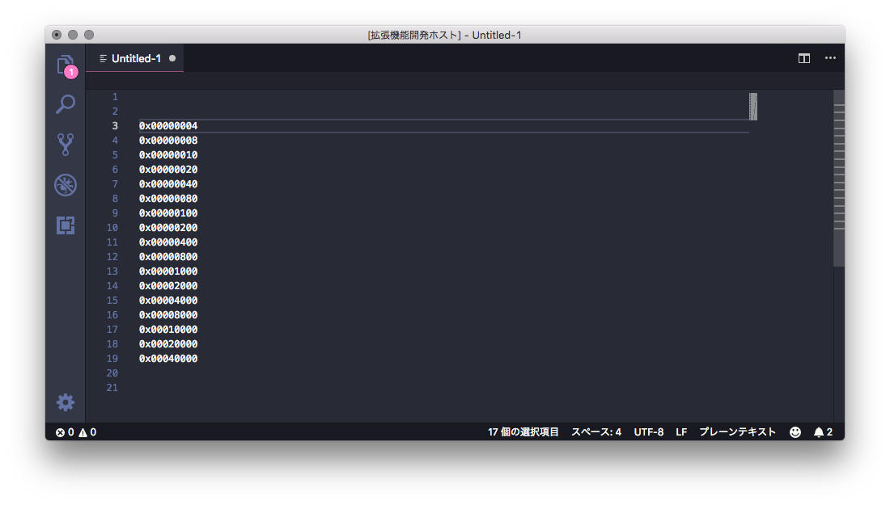

# :pencil: Insert Multiple Rows

     

A extension to insert sequential number / bit-field / character to multi-cursor rows.

## Features

All features calculate digits automatically and insert from any number.

USAGE: Set multi-cursor and call bellow commands.

> Attention: Insertion is performed cursor-selection-order.

### _Command_: :1234: Insert decimal to multiple rows

> Image sample sets a space to `insertDecimalToMultipleRows.paddingChar`

### _Command_: :zero: Insert bitfield to multiple rows

### _Command_: :capital_abcd: Insert charcter to multiple rows

## Extension Settings

- `insertDecimalToMultipleRows.paddingChar`
  - What: padding character for "Insert decimal to multiple rows" command
  - Default: '0'
  - Value: single character

## [Release Note](./CHANGELOG.md)
